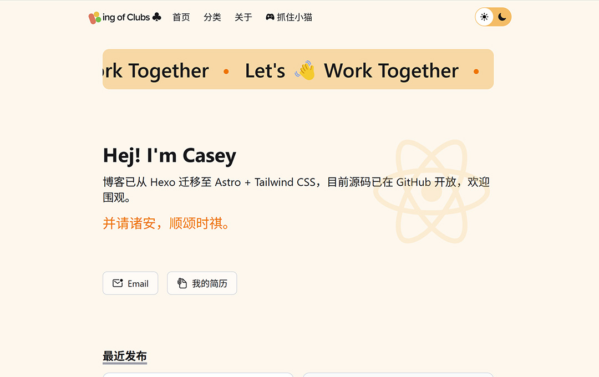

<p align="center">
  <a title="Astro Version" target="_blank" href="https://astro.build/"></a>
  <a title="Node Version" target="_blank" href="https://nodejs.org/zh-cn/"></a>
  <a title="License" target="_blank" href="https://github.com/kcjiang/kcjiang.github.io/blob/main/LICENSE"></a>
</p>

<p align="center">🇨🇳 中文简体  |  <a title="English" href="README_EN.md">🇬🇧 English</a></p>

## 预览

[](https://kaicheng.me/)

灵感来源: 👻 [ghost-theme-dawn](https://ghost.org/themes/dawn/)

## 安裝

使用 Git 克隆到本地

```powershell
git clone -b main https://github.com/kcjiang/kcjiang.github.io.git astro-project
```

## 技术栈

- [Astro](https://astro.build/) - 静态网站框架
- [Tailwind CSS](https://tailwindui.com/) - CSS 框架
- [React](https://reactjs.org/) - 基于组件的 UI 框架
- [Headless UI](https://headlessui.com/) - 无样式交互组件
- [React Icons](https://react-icons.github.io/react-icons/) - 图标集